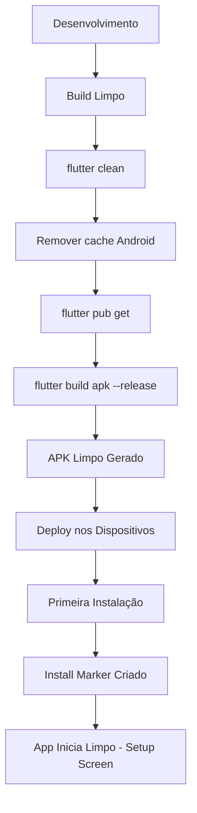

# 🧹 Problema do Cache no APK - Solução

## ❓ Problema Identificado

O APK estava sendo compilado com **dados pré-gravados da lista M3U**, fazendo com que a aplicação não iniciasse limpa (sem dados de lista).

## 🔍 Causa Raiz

### 1. **Cache de Desenvolvimento**
Durante o desenvolvimento, o Flutter/Android pode manter cache de builds anteriores que incluem:
- Arquivos `.gradle` com configurações antigas
- Diretórios `build/` com artefatos anteriores
- Cache do Gradle com dependências compiladas

### 2. **Dados de Runtime NÃO são o problema**
Os seguintes dados **NÃO** vão para o APK (são criados em runtime):
- ✅ Cache M3U: `getApplicationSupportDirectory()/m3u_cache_*.m3u`
- ✅ Cache EPG: `getApplicationSupportDirectory()/epg_cache.xml`
- ✅ SharedPreferences: `playlist_url_override`, etc.

Estes são criados **DEPOIS** da instalação, no dispositivo do usuário.

### 3. **O Problema Real**
O build não estava sendo limpo antes de compilar, resultando em:
- Artefatos de builds anteriores sendo reutilizados
- Configurações de debug sendo misturadas com release
- Cache do Gradle interferindo no build

## ✅ Solução Implementada

### Scripts de Build Limpo

Criados dois scripts que garantem compilação limpa:

#### Windows: `build_clean.ps1`
```powershell
./build_clean.ps1
```

#### Linux/Mac: `build_clean.sh`
```bash
chmod +x build_clean.sh
./build_clean.sh
```

### O que os scripts fazem:

1. **🧹 Limpar Build Anterior**
   ```bash
   flutter clean
   ```

2. **🗑️ Remover Cache de Desenvolvimento**
   - `android/.gradle/` - Cache do Gradle
   - `android/build/` - Build do Android
   - `android/app/build/` - Build do app

3. **📦 Atualizar Dependências**
   ```bash
   flutter pub get
   ```

4. **🔨 Compilar APK Release LIMPO**
   ```bash
   flutter build apk --release --no-tree-shake-icons
   ```

## 🎯 Como o App Detecta Primeira Instalação

O código já tem um mecanismo robusto para detectar primeira instalação:

```dart
// Em lib/main.dart (linhas 46-60)
final hasInstallMarker = await M3uService.hasInstallMarker();
if (!hasInstallMarker) {
  print('♻️ main: No install marker found — treating as fresh install');
  await Prefs.setPlaylistOverride(null);
  Config.setPlaylistOverride(null);
  await M3uService.clearAllCache(null);
  await M3uService.writeInstallMarker();
  await Prefs.setFirstRunDone();
}
```

### O que acontece na primeira instalação:
1. ✅ Verifica se existe marker de instalação
2. ✅ Se não existe (primeira vez):
   - Limpa playlist override
   - Limpa todos os caches
   - Cria marker de instalação
   - Marca first run como concluído

## 📊 Fluxo Correto de Deploy



## 🚀 Workflow Recomendado

### Passo 1: Build Limpo
```powershell
./build_clean.ps1
```

### Passo 2: Deploy Automático
```powershell
./deploy.ps1
```

OU manualmente:

### Passo 2 (Manual): Deploy
```bash
# Conectar dispositivos
adb connect 192.168.3.110:5555  # Fire Stick
adb connect 192.168.3.159:5555  # Tablet

# Instalar
adb -s 192.168.3.110:5555 install -r build/app/outputs/flutter-apk/app-release.apk
adb -s 192.168.3.159:5555 install -r build/app/outputs/flutter-apk/app-release.apk
```

## ✅ Verificação Pós-Deploy

Após instalar o APK nos dispositivos, verifique:

1. **App inicia na Setup Screen** (sem playlist pré-configurada)
2. **Nenhum conteúdo aparece automaticamente**
3. **Usuário precisa configurar URL da playlist**

## 🔧 Troubleshooting

### Problema: APK ainda tem dados
**Solução:**
1. Desinstalar completamente o app do dispositivo
2. Executar `build_clean.ps1`
3. Reinstalar

### Problema: App não inicia
**Solução:**
1. Verificar logs: `adb logcat | grep -i flutter`
2. Verificar se ADB está conectado: `adb devices`

### Problema: Build falha
**Solução:**
1. Verificar Flutter: `flutter doctor`
2. Limpar cache global: `flutter pub cache repair`
3. Reexecutar `build_clean.ps1`

## 📝 Notas Importantes

1. **Sempre use `build_clean.ps1` antes de gerar APK de release**
2. **O script `deploy.ps1` NÃO faz build limpo automaticamente**
3. **Se quiser build limpo + deploy, execute:**
   ```powershell
   ./build_clean.ps1
   ./deploy.ps1
   ```

## 🔐 Segurança

O arquivo `.env` com credenciais **NÃO** vai para o APK, pois:
- É listado no `.gitignore`
- Não é incluído no build do Flutter
- Valores são lidos em compilação, não em runtime

## 📦 Arquivos Criados

| Arquivo | Propósito |
|---------|-----------|
| `build_clean.ps1` | Build limpo no Windows |
| `build_clean.sh` | Build limpo no Linux/Mac |
| `deploy.ps1` | Deploy automático (Windows) |
| `deploy.sh` | Deploy automático (Linux/Mac) |
| `DEPLOYMENT_GUIDE.md` | Guia completo de deployment |
| `BUILD_CLEAN_EXPLANATION.md` | Este documento |

## ✨ Resultado Final

✅ APK compilado **SEM** cache de desenvolvimento  
✅ App inicia **LIMPO** (Setup Screen)  
✅ Nenhum dado pré-configurado  
✅ Usuário configura playlist manualmente  
✅ Install marker funciona corretamente  
✅ IPs corretos: Fire Stick (192.168.3.110) e Tablet (192.168.3.159)  

